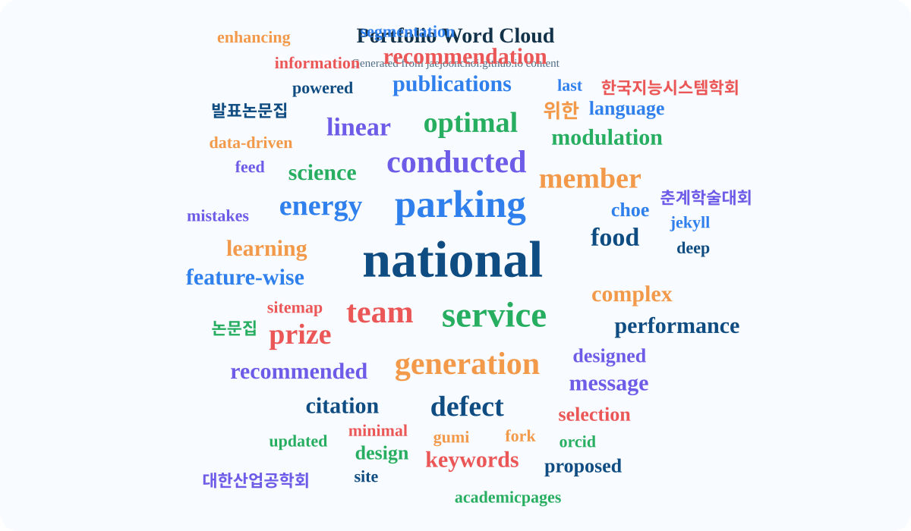

**Hello! Thank you for visiting my GitHub.**    
**E-mail:** cjj1222@khu.ac.kr   
**Google Scholar:** https://scholar.google.com/citations?user=SNXZCcgAAAAJ&hl=ko   
**Experience**
- `Mar.2025 - Present`, M.S. Student, [AIMS Lab](https://sites.google.com/khu.ac.kr/aims/home?authuser=0), Department of Industrial and Management Systems Engineering, Kyung Hee University, Yongin, Korea
- `Mar.2024 - Feb.2025`, Undergraduate Research Assistant Student, [HAIDS Lab](https://sites.google.com/view/ids-kit/home), Department of Industrial Engineering, Kumoh National Institute of Technology, Gumi, Korea
- `Apr.2023 - Feb.2024`, Undergraduate Research Student, [Kumoh National Institute of Technology Industry-academic Cooperation Foundation](http://sian3.adbank.co.kr/kit_iacf/main/sub01/sub01_03.html), Kumoh National Institute of Technology, Gumi, Korea   
----------

  

  
  
  
  

---

## About Me
- 🎓 M.S. Graduate Student in Industrial and Management Systems Engineering at Kyung Hee University (2025.03-Current).
- 🎓 B.S. Department of Industrial Engineering & Covergence Major., Major of Smart Factory at Kumoh National Institute of Technology (2019.03-2025.02).

  

    
  

---

## Research Highlights

| Topic | Category | Title | Keywords |
| :-- | :-- | :-- | :-- |
| 📉Industrial Power Consumption Prediction | Journal | [Designing a data-driven energy management service: A case study of South Korea's national industrial complex (IEEE Access)](https://ieeexplore.ieee.org/document/10820349) | Energey Management, Time-Series Analysis, LSTM, Service Information Design |
| 👁️Manufacturing Image Data Defect Classification & Segmentation | Conference | [Feature-Wise Linear Modulation-based conditional segmentation model for wafer bin map classification](https://jaejoonchoi.github.io//publication/2025-11-06-presentation-1) | Mixed-type Wafer Bin Map Defects Semantic Segmentation, Conditional Generation, Disentanglement of Mixed Defects, Feature-wise Linear Modulation (FiLM) |
| ֎🇦🇮 LLM | Data Analysis Competition | RAG-FSR(Retrieval Augmented Generation-Food Science Research): A Language Model for Classifying Food Research Journals using Natural Language Processing and Retrieval-Augmented Generation | RAG, LLM, Food Research & Journal Paper, Semantic Search |

---

## Featured Projects

### Computer Vision AI Model & Application Industry Sector

👁️🔬𖦏 Conditional Generation of Overlapping Mixed-type Wafer Bin Map Defects via Feature-wise Linear Modulation <strong>(Research)</strong>

- **Conditional Semantic Generation, Overlapping Defect Disentanglement, Feature-Wise Linear Modulation, Mixed-Type Wafer Bin Map. `Poster & Oral Presentation at Conference (Korean Institute of Industrial Engineers, Korea Data Mining Society)`**
- The purpose of this study is to resolve the ambiguous prediction of overlapping regions in mixed-type wafer bin map (WBM) defects, thereby supporting precise engineering decision-making.
- To address this, we propose the Wafer Conditional Generative Network (WCGN), a conditional generation framework that integrates Feature-wise Linear Modulation (FiLM) into a U-Net architecture to generate corresponding defect masks based on a target defect label.
- In experiments utilizing the MixedWM38 dataset and a generated benchmark, the model achieved an Exact Match Ratio (EMR) of 97.85% and a mean Intersection over Union (mIoU) of 0.8725, demonstrating superior classification and segmentation performance over state-of-the-art baselines, even in overlapping defect environments.
- The key implication is that the model vastly improves interpretability by visualizing the spatial structures of concealed individual defects at the pixel level through conditional mask generation, moving beyond merely outputting black-box defect labels.
- Ultimately, this model is expected to assist process engineers in intuitively and accurately diagnosing the root causes of complex defects, thereby significantly contributing to the optimization of process monitoring and practical yield enhancement in semiconductor manufacturing. 
- [SSRN Paper](https://papers.ssrn.com/sol3/papers.cfm?abstract_id=6532561)

👁️🔬⚠️Prediction of Mixed Defect Types in Semiconductors Using Vision Transformer and Similarity-Based Methods <strong>(Research)</strong>

- **Vision Transformer, Similarity Distance, Deep Learning, Mixed-Type Wafer Bin Map**
- The goal is to predict dual defect types in data using only single defect data.
- Two models based on Vision Transformers and KNN algorithms were designed, using Euclidean and Gaussian distance calculation methods for comparative analysis.
- Prediction of dual defect types involving ‘Edge_Loc’ showed higher accuracy than previous studies using CNN, but overall performance was not satisfactory.
- [More Content](https://github.com/JaejoonChoi/2024-1_Capstone-Design)

### Time-Series Analysis AI Model & Application Industry Sector

⚡📉 Designing a KEPCO Power Data-Driven Energy Management Service: A Case Study of South Korea’s National Industrial Complex <strong>(Research)</strong>

  
- **Machine/Deep Learning, Energey Management, Data-Driven Service Information Design. `Awarded Grand Prize in the 2023 Gumi Industrial Complex Energy Self-Sufficiency Datathon (KEPCO)`, `Poster Presentation at Conference (Korean Institute of Industrial Engineers)` and `Published Journal Article (IEEE Access)`**
- EG(Eco Gumi)-Service: Integrated Platform for Energy Efficiency and Sustainable Energy Use
- This study proposes a design and application plan for a data-driven intelligent Energy Management Service (EMS) tailored for tenant companies within South Korea's national industrial complex.
- By collecting and analyzing large-scale electricity consumption data generated from various manufacturing facilities within the industrial complex provided by the Korea Electric Power Corporation (KEPCO), it proposes a system architecture designed to identify energy waste factors and optimize operational efficiency.
- Based on KEPCO's electricity consumption data from small and medium-sized enterprises (SMEs) in the national industrial complex, we designed a Data-Driven Energy Management Service (DEMS) that clusters companies with similar consumption patterns using the Dynamic Time Warping (DTW) algorithm and builds customized electricity consumption prediction models for each cluster utilizing Long Short-Term Memory (LSTM) networks.
- Evaluation of the developed LSTM-based prediction models revealed very low Mean Absolute Error (MAE) values of 0.068, 0.054, and 0.050 across the three clusters, respectively, demonstrating high accuracy and excellent performance in short-term electricity consumption forecasting.
- By providing customized information such as real-time electricity forecasting, tariff warnings, and consumption comparisons with other companies within the same cluster, small and medium-sized manufacturing enterprises can proactively manage peak electricity demand and optimize operational efficiency. Ultimately, this allows them to achieve tangible business benefits, including substantial reductions in electricity bills and the prevention of unnecessary energy expenditures.
- [Journal Article (IEEE Access)](https://ieeexplore.ieee.org/document/10820349)

💵📉 Salary Prediction for KBO Players Eligible for Free Agent (FA) in 2024 <strong>(Analysis)</strong>

  
- **Machine Learning, Data Mining, Salary Prediction.**
- Collected performance metrics for KBO players who signed FA contracts from 2019 to 2023.
- The correlation analysis revealed a strong relationship between sabermetric indicators and Free Agent (FA) contract amounts, confirming the effectiveness of statistically detailed and scientific metrics like sabermetrics
- Created a model using RandomForestRegressor with performance metrics that had a correlation of 0.5 or higher.
- Ultimately, I realized that relying exclusively on statistical indicators to determine a player's FA value would be a hasty conclusion.
- [More Content](https://github.com/JaejoonChoi/Prediction-of-2024-KBO-Players-Free-Agency-Salaries)

### ֎🇦🇮 LLM & AI Agent

📢📩 Amore-Pacific CRM Message Generation System <strong>(Data Analysis Competition</strong>)

- **Multi-agent CRM Message Generation System Using LangGraph, Persona Analysis, Product Matching, and Automated Quality Checks.**
- We proposed a Persona Analyzer that conducts in-depth analysis of psychological purchase motivations based on 8 core beauty segments, moving beyond simple demographic analysis to understand the customer’s context.
- We implemented a Product Matcher using a ChromaDB-based RAG pipeline, converting 2,753 original Amorepacific product data points into 516 core product categories to perform semantic matching aligned with the persona’s skin concerns and brand information.
- By integrating a Message Generator that applies brand-specific tone and manner, and a Quality Checker that validates character limits and predicts CTR, we ensured the generation of high-quality, optimal CRM messages with a robust retry and fallback mechanism.
- Through this approach, we expect to significantly improve email open rates (+150-194%) and CTR (+150-192%) while reducing message generation time by over 95%, ultimately maximizing CRM operational efficiency and transforming marketers into strategic designers.
- [More Contents](https://github.com/jaejunchoe/2026-Amore-Pacific-AI-Innovation-Challenge)

📜🏛️ Korea Food Research Institute (KFRI)'s Retrieval Augmented Generation-Food Science Research (RAG-FSR): A Language Model for Classifying Food Research Journals using Natural Language Processing and Retrieval-Augmented Generation <strong>(Data Analysis Competition)</strong>

- **Food Science Research Classification System Using Retrieval-Augmented Generation. Awarded `Top Excellence Prize` in the 2025 Korea Food Research Institute competition.**
- As the volume of academic data in science and technology rapidly increases, researchers are facing difficulties in searching for prior studies and classifying content due to the limitations of existing keyword-based search systems.
- To address this problem, we propose and implement RAG-FSR (Retrieval-Augmented Generation for Food Science Research), a language model specialized for the food research domain that utilizes Retrieval-Augmented Generation (RAG) technology.
- The results showed that RAG-FSR achieved an accuracy of 0.960, particularly in the multi-keyword classification task. Furthermore, on the exact-match accuracy metric for abstract generation, our model performed approximately 4-9 times better than the baseline models.
- This empirically demonstrates that the proposed model effectively mitigates the hallucination phenomenon common in large language models and can function as a highly accurate and reliable information classification and retrieval system for food science research data.

### 🎯 Operations Research & Optimization

🅿️⚙️ Convex Optimization-Based Municipal Parking Lot Recommendation System in Seoul <strong>(Analysis)</strong>

- **Dynamic Parking Recommendation System Using Convex Optimization and CVXPY with Real-Time Context-Aware Weighting.**
- To resolve the issues of unbalanced utilization rates and parking shortages in Seoul’s municipal parking lots, we designed a convex optimization-based dynamic parking recommendation AI agent that allocates the optimal parking lot by reflecting real-time urban data.
- We proposed an objective function that simultaneously minimizes parking lot congestion, user travel distance, and parking fees. Additionally, we prevented demand concentration at specific parking lots by applying capacity overflow prevention and an upper bound constraint on congestion ($\rho_{max}$).
- We implemented a framework that assigns the optimal parking lot utilizing the CVXPY solver, and integrated a feature where an LLM dynamically recommends hyperparameter weights ($\alpha, \beta, \gamma$) based on real-time situational prompts, such as city festivals or events.
- Through this approach, we achieved superior performance across all metrics compared to the conventional Greedy algorithm—including improvements in congestion (+8.2%, +7.5%), parking costs (+4%, +5.8%), and travel distance (+0.2%, +0.8%) for weekdays and weekends, respectively. Furthermore, we demonstrated that this system can effectively alleviate users’ parking search time and stress while guaranteeing a global optimal solution.
- [More Cotents](https://github.com/jaejunchoe/convex_25_kyunghee)

### 💻 Robustness Enhancement Systems

🛡️🧬 CCGAFuzz: Curriculum-Guided Adaptive Fuzzing Framework <strong>(Research)</strong>

- **Curriculum-Guided Adaptive Fuzzing Framework Combining AFL++ with Adaptive Mutation and Optional LLM-Assisted Seed Generation. `Awarded Excellence Prize in the 2025 AI-Powered Vulnerability Discovery System Competition and Oral Presentation at Conference  (Korean Institute of Information Scientists and Engineers)`**
- We designed a three-phase progression strategy based on JSON validation success rates using Parse-Rate Driven Curriculum Learning.
- We proposed EMA-Based Adaptive Mutation, a lightweight and real-time operator scheduling mechanism that learns mutations capable of discovering new paths.
- We implemented Plateau Detection to automatically identify coverage stagnation and integrated optional LLM support to generate diverse initial seeds.
- By presenting a novel approach for structured input fuzzing via Parse-Rate Driven Curriculum Learning, Lightweight EMA-Based Scheduling, and an Automatic Phase Transition Mechanism, we demonstrated suitability for real-time high-throughput fuzzing and achieved synergy between parse-rate phases and coverage monitoring.
- Through this approach, we demonstrated superior performance in both code coverage (+4.03%) and execution speed (+6.50%) compared to standard AFL++, significantly enhancing the efficiency of vulnerability analysis for software with complex structures.
- [More Cotents]([https://github.com/jaejunchoe/convex_25_kyunghee](https://github.com/HyeonjongJang/CGAFuzz))

🎭📋🧭 Enhancing Recommender Systems through Amazon Sentiment-Aware Rating Recalibration <strong>(Research)</strong>

- **Recommendation System, Sentiment-Rating Recalibration & Analysis. `Poster Presentation at Conference (Korean Institute of Intelligent Systems)`**
- The objective of this study is to enhance the accuracy and reliability of recommendation systems by addressing the discrepancy between user-provided ratings and the actual emotional context embedded in the review text.
- To achieve this, we propose a methodology that utilizes the BERT-multilingual-uncased model to calculate sentiment ratings and confidence levels from review texts, and employs the text-specialized DeepCoNN model to find the optimal confidence threshold for rating recalibration.
- Through experiments with various hyperparameter combinations, the model achieved its best performance with a Mean Squared Error (MSE) of 2.47 at a confidence threshold of 0.6 and a learning rate of 0.01, demonstrating an improvement over the existing Baseline model (MSE 2.56).
- Unlike previous methods that simply incorporate sentiment analysis results, this study empirically confirms that a differentiated approach—replacing the original rating only when the sentiment analysis confidence exceeds a certain threshold—effectively mitigates the uncertainty of recommendation outcomes.
- In the future, applying this methodology to diverse recommendation algorithms and multilingual environments is expected to significantly contribute to the overall performance improvement of recommendation systems by generalizing and advancing personalized content delivery.  
- [More Cotents]([https://jaejoonchoi.github.io//publication/2025-04-26-poster-3))

🎭📋✅ Optimal Data Selection from Amazon Sentiment-Rating Analysis for Improving Recommendation Systems <strong>(Research)</strong>

- **Recommendation System, Sentiment-Rating Analysis, Optimal Data Selection. `Poster Presentation at Conference (Korean Institute of Intelligent Systems)`**
- The objective of this study is to propose a method for refining and selecting optimal training data based on sentiment-rating consistency to address the issue where discrepancies between review text sentiment and user ratings act as noise, degrading recommendation model performance.
- To achieve this, we propose a methodology that classifies data into four groups (non-confidence, consistent, uncertain, inconsistent) based on the Manhattan distance and the confidence level of sentiment analysis results derived from the RoBERTa model, and evaluates performance by training the DeepCoNN model on various combinations of these groups.
- Through experiments with various hyperparameter and data combinations, the model achieved the highest prediction accuracy with a Mean Squared Error (MSE) of 1.192 when trained exclusively on the 'uncertain' data group under the conditions of a 0.7 confidence threshold, a 0.001 learning rate, and a batch size of 64.
- A significant implication of this study is the empirical validation, through double cross-validation, that data with a certain level of discrepancy between sentiment and rating (the 'uncertain' group) actually provides information diversity during model training, effectively contributing to improved generalization performance.
- By simultaneously securing the precision and reliability of recommendation systems through a sophisticated data-driven approach, this research is expected to significantly contribute to commercialization through future applications in real-world e-commerce and content platforms, as well as expansion into various domains.  
- [More Cotents](https://jaejoonchoi.github.io//publication/2025-04-26-poster-2)

---

## Links

### Homepage (Press on the image below)
- Portfolio: https://jaejoonchoi.github.io/
- Publications: https://jaejoonchoi.github.io/publications/
- Side Projects: https://jaejoonchoi.github.io/project/
- ORCID: https://orcid.org/0009-0005-9158-018X

## Using Dataset

